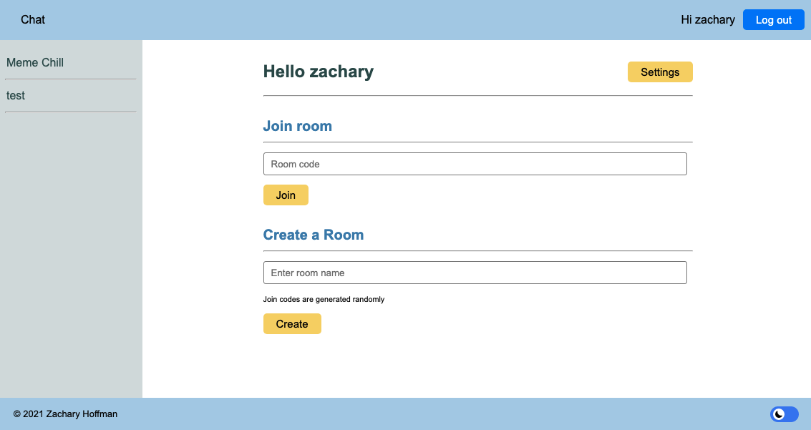
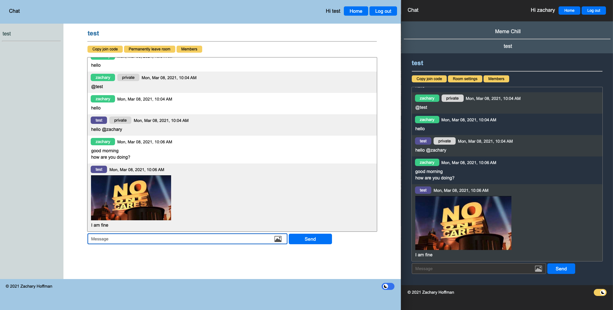

# webchat
Functional multi-room chat website.

Uses Python for back end (Flask framework).  

The Python connects to a MySQL database to manage data and communicicates with PHP to manage user-uploaded files.

Uses SocketIO, GET, and POST requests to communicate between the client and back-end sides.

The client side uses JavaScript in order to communicate to the server and manage the front-end behavior of the site.

Some features

<ul>
  <li>Log in system</li>
  <li>User-created and user-managed rooms</li>
  <li>Can send any type of file</li>
  <li>Private messaging</li>
  <li>Light and dark themes</li>
</ul>

